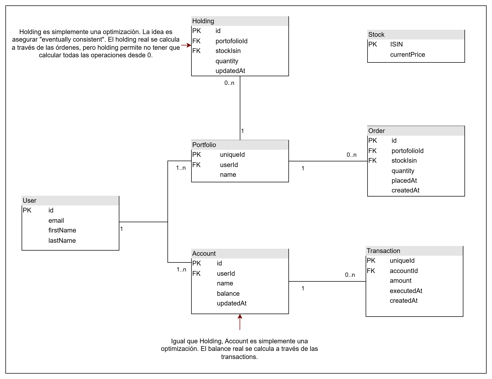

# Desafío Racional API

## Instrucciones para correr el proyecto:

### Con docker-compose:

1. Clonar el repositorio
2. Ejecutar `docker-compose up --build` en la raíz del proyecto
3. La API estará disponible en `http://localhost:3000`

### Sin docker (no asegura compatibilidad):

1. Clonar el repositorio
2. Instalar dependencias con `npm install`
3. Configurar una base de datos PostgreSQL y un usuario con acceso a ella. Actualizar las variables de entorno en el archivo `.env` (puede copiar el archivo `.env.example` y modificarlo)
4. Ejecutar las migraciones con `npm run db:migrate` y opcionalmente las semillas con `npm run db:seed`.
5. Compilar el proyecto con `npm run build` y luego iniciar el servidor con `npm start` o usar `npm run dev` para iniciar el servidor en modo desarrollo (con hot reload).
6. La API estará disponible en `http://localhost:3000`

## Uso de IA:

Para el pensamiento del diseño utilicé Claude, ChatGPT y Gemini para validar ideas, obtener algunas sugerencias e investigar sobre el estándar para algunos detalles técnicos. La decisión final sobre el diseño siempre fue mía y hubieron cosas que la IA no tomaba en cuenta (por ejemplo, el uso de `createdAt` y `updatedAt` para prevenir inconsistencias en cuentas y holdings).

Para la elección de tecnologías y setup inicial me apoyé mucho en IA, pero le pedí específicamente que me preguntara por las tecnologías que quería usar, porque las quería usar y que otras opciones había. Muchas veces me fui por tecnologías que ya conocía en vez de la recomendada. Además, cada setup de tecnología lo revisé en profundidad y lo modifiqué a mi criterio.

También creé un comando de Claude para generar tests a cada una de las rutas implementadas (se puede ver en .claude/commands/test-route.md). Este comando me ayudó a generar tests de integración completos para cada ruta. Cómo no es una aplicación de producción, no me preocupé de que sea completamente exhaustiva, pero me ayudá a desarrollar y tener cierta seguridad de que las funcionalidades estaban bien implementadas.

Por último, use también Claude como inicio de cada commit, pero todos estas implementaciones fueron revisadas en profundidad y modificadas para mantener estándares de calidad y clean code mínimos. La lógica es completamente pensada por mí, la IA la usé principalmente para escribir el código de forma más rápida.

## Asunciones:

Como el sistema permite registrar operaciones con fechas pasadas, no se puede validar completamente la factibilidad de órdenes de compra o retiro en tiempo real. Por ejemplo, podría registrarse primero un retiro de dinero y luego una orden de compra que tenga fecha anterior al retiro, lo que generaría ambigüedad en relación a cuál operación es válida.

Por esta razón, se asume que el sistema funciona como un registro histórico de operaciones, y no como un sistema transaccional en tiempo real.

## Modelo de datos:

**Imagen Diagrama de Entidad-Relación:**


### Justificación del modelo de datos:

- Usuarios, portafolios y cuentas
  - Cada usuario puede tener múltiples portafolios o cuentas. Esta decisión permite mayor flexibilidad y escalabilidad a futuro, además de desacoplar estas entidades del usuario.
  - Actualmente, la API asume que cada usuario tiene un solo portafolio y una sola cuenta, lo que simplifica la implementación. Sin embargo, el modelo de datos ya está preparado para soportar múltiples portafolios o cuentas sin necesidad de cambios estructurales.
  - El portafolio y la cuenta se crean automáticamente al registrar un nuevo usuario.

- Órdenes, transacciones, cuentas y holdings
  - Las entidades principales del sistema son las órdenes y las transacciones, que son el historial de todas las operaciones.
  - Por otro lado, las cuentas y los holdings (cantidad de acciones en el portafolio) sirven para optimizar consultas, evitando recalcular constantemente la información a partir del historial completo.

  - Para prevenir inconsistencias (por la duplicación de información), se usan atributos específicos:
    - Las órdenes y transacciones tienen un campo `createdAt`.
    - Las cuentas y los holdings tienen un campo `updatedAt`.

  - Cada vez que se consulta un portafolio o una cuenta, primero se actualizan sus datos usando todas las órdenes y transacciones nuevas (todas las con `createdAt` mayor a `updatedAt`). Sólo después de esta actualización se devuelve la información al cliente.

- Almacenamiento de stocks
  - Los stocks se almacenan en la base de datos usando el código ISIN como clave primaria, y solo se guarda su precio. Ninguna otra tabla tiene una relación directa con la tabla de stocks, sino que se relacionan a través del código ISIN. Evité JOINS con esta tabla en consultas para mantenerlo desacoplado.

  - Esto simplifica el modelo y lo desacopla del resto del sistema. En caso de integrar una API real, solo habría que modificar el `stockPriceProvider`.

- Fechas de operaciones
  - Las órdenes y transacciones incluyen los campos `executedAt` y `placedAt` correspondientemente, que representan la fecha en que ocurrió la operación, a diferencia de `createdAt` que representa la fecha en que se registró en el sistema.

## Cumplimiento de Requisitos

Aquí se encuentra un resumen de cómo se cumplen los requisitos del desfío, para más detalle de la API y su uso, revisar la sección de Rutas.

1. Registrar una depósito/retiro (ambas son requeridas) de un usuario (monto + fecha):
   - Para registrar un depósito se debe usar la ruta `POST /users/:userId/transactions` con un monto positivo.
   - Para registrar un retiro se debe usar la misma ruta pero con un monto negativo.

2. Registra una orden de compra/venta (ambas son requeridas) de una Stock:
   - Para registrar una orden de compra se debe usar la ruta `POST /users/:userId/portfolio/orders` con una cantidad positiva.
   - Para registrar una orden de venta se debe usar la misma ruta pero con una cantidad negativa.

3. Edita información personal del usuario:
   - Se puede editar el email, nombre y apellido del usuario usando la ruta `PATCH /users/:userId`.

4. Edita información del portafolio del usuario:
   - Se puede editar el nombre del portafolio usando la ruta `PATCH /users/:userId/portfolio`.

5. Consultar el total de un portafolio de un usuario:
   - Se puede consultar el valor total del portafolio usando la ruta `GET /users/:userId/portfolio/total`.

6. Consultar los últimos movimientos del usuario.
   - Se pueden consultar las últimas órdenes y transacciones del usuario usando la ruta `GET /users/:userId/operations`.
   - También se pueden consultar por separado usando `GET /users/:userId/portfolio/orders` para órdenes y `GET /users/:userId/transactions` para transacciones.

## Rutas

#### `POST /users`

**Descripción breve:** Crea un nuevo usuario.

**Body:**
| Campo | Tipo | Requerido | Descripción |
|-------|------|-----------|-------------|
| `email` | string (email) | Sí | Correo electrónico del usuario |
| `firstName` | string | No | Nombre |
| `lastName` | string | No | Apellido |

**Respuestas:**

- `201` — Usuario creado

```json
{
  "id": "...",
  "email": "...",
  "firstName": "...",
  "lastName": "..."
}
```

- `400` — Datos inválidos
- `409` — El email ya está en uso

---

#### `GET /users`

**Descripción breve:** Helper para obtener una lista de todos los usuarios .

**Respuesta `200`:**

```json
{
  "id": "...",
  "email": "...",
  "firstName": "...",
  "lastName": "..."
}
```

---

#### `GET /users/:userId`

**Descripción breve:** Obtiene la información de un usuario junto con el saldo de su cuenta.

**Parámetros de ruta:**

- `userId` — ID del usuario

**Respuesta `200`:**

```json
{
  "id": "...",
  "email": "...",
  "firstName": "...",
  "lastName": "...",
  "balance": 1000.0
}
```

- `404` — Usuario no encontrado

---

#### `PATCH /users/:userId`

**Descripción breve:** Actualiza los datos modificables de un usuario. Al menos un campo debe ser enviado.

**Parámetros de ruta:**

- `userId` — ID del usuario

**Body (al menos uno requerido):**
| Campo | Tipo | Descripción |
|-------|------|-------------|
| `firstName` | string | Nombre |
| `lastName` | string | Apellido |
| `email` | string (email) | Correo electrónico |

**Respuestas:**

- `200` — Usuario actualizado

```json
{
  "id": "...",
  "email": "...",
  "firstName": "...",
  "lastName": "..."
}
```

- `400` — Datos inválidos o body vacío
- `409` — El email ya está en uso

---

### Portafolio — `/users/:userId/portfolio`

#### `GET /users/:userId/portfolio`

**Descripción breve:** Obtiene el portafolio del usuario con los stocks que posee.

**Parámetros de ruta:**

- `userId` — ID del usuario

**Respuestas:**

- `200` — Datos del portafolio

```json
{
  "id": "...",
  "name": "...",
  "holdings": [
    {
      "id": "...",
      "portfolioId": "...",
      "stockIsin": "...",
      "quantity": 10,
      "updatedAt": "2026-01-01T00:00:00.000Z",
      "holdingValue": 1000.0
    },
    ...
  ]
}
```

- `404` — Portafolio no encontrado

---

#### `GET /users/:userId/portfolio/total`

**Descripción breve:** Obtiene el valor total del portafolio del usuario (suma del valor de todos los stocks que posee).

**Parámetros de ruta:**

- `userId` — ID del usuario

**Respuestas:**

- `200` — Valor total del portafolio

```json
{
  "total": 5000.0
}
```

- `404` — Portafolio no encontrado

---

#### `PATCH /users/:userId/portfolio`

**Descripción breve:** Actualiza la información modificable del portafolio del usuario.

**Parámetros de ruta:**

- `userId` — ID del usuario

**Body:**
| Campo | Tipo | Requerido | Descripción |
|-------|------|-----------|-------------|
| `name` | string | Sí | Nuevo nombre del portafolio |

**Respuestas:**

- `200` — Portafolio actualizado

```json
{
  "id": "...",
  "userId": "...",
  "name": "..."
}
```

- `400` — Datos inválidos
- `404` — Portafolio no encontrado

---

### Órdenes — `/users/:userId/portfolio/orders`

#### `POST /users/:userId/portfolio/orders`

**Descripción breve:** Registra una nueva orden de compra/venta de acciones en el portafolio del usuario.

**Parámetros de ruta:**

- `userId` — ID del usuario

**Body:**
| Campo | Tipo | Requerido | Descripción |
|-------|------|-----------|-------------|
| `stockIsin` | string | Sí | Código ISIN de la acción |
| `quantity` | integer | Sí | Cantidad de acciones (positivo = compra, negativo = venta) |
| `placedAt` | date | Sí | Fecha y hora en que se realizó la orden |

**Respuestas:**

- `201` — Orden creada

```json
{
  "id": "...",
  "portfolioId": "...",
  "stockIsin": "...",
  "quantity": 10,
  "placedAt": "2026-01-01T00:00:00.000Z",
  "createdAt": "2026-02-01T00:00:00.000Z"
}
```

- `400` — Datos inválidos
- `404` — Portafolio no encontrado

---

#### `GET /users/:userId/portfolio/orders`

**Descripción breve:** Lista las órdenes del portafolio del usuario.

**Parámetros de ruta:**

- `userId` — ID del usuario

**Query params (opcionales):**
| Parámetro | Tipo | Descripción |
|-----------|------|-------------|
| `limit` | integer positivo | Máximo de órdenes a retornar |
| `from` | date | Filtrar órdenes desde esta fecha |

**Respuestas:**

- `200` — Lista de órdenes

```json
[
  {
    "id": "...",
    "portfolioId": "...",
    "stockIsin": "...",
    "quantity": 10,
    "placedAt": "2026-01-01T00:00:00.000Z",
    "createdAt": "2026-02-01T00:00:00.000Z"
  },
  ...
]
```

- `400` — Parámetros inválidos
- `404` — Portafolio no encontrado

---

### Transacciones — `/users/:userId/transactions`

#### `POST /users/:userId/transactions`

**Descripción breve:** Registra una nueva transacción (depósito o retiro) en la cuenta del usuario.

**Parámetros de ruta:**

- `userId` — ID del usuario

**Body:**
| Campo | Tipo | Requerido | Descripción |
|-------|------|-----------|-------------|
| `amount` | number | Sí | Monto (positivo = depósito, negativo = retiro) |
| `executedAt` | date | Sí | Fecha y hora en que se ejecutó la transacción |

**Respuestas:**

- `201` — Transacción creada

```json
{
  "id": "...",
  "userId": "...",
  "accountId": "...",
  "amount": 1000.0,
  "executedAt": "2026-01-01T00:00:00.000Z",
  "createdAt": "2026-02-01T00:00:00.000Z"
}
```

- `400` — Datos inválidos
- `404` — Cuenta no encontrada

---

#### `GET /users/:userId/transactions`

**Descripción breve:** Lista las transacciones de la cuenta del usuario.

**Parámetros de ruta:**

- `userId` — ID del usuario

**Query params (opcionales):**
| Parámetro | Tipo | Descripción |
|-----------|------|-------------|
| `limit` | integer positivo | Máximo de transacciones a retornar |
| `from` | date | Filtrar transacciones desde esta fecha |

**Respuestas:**

- `200` — Lista de transacciones

```json
[
  {
    "id": "...",
    "userId": "...",
    "accountId": "...",
    "amount": 1000.0,
    "executedAt": "2026-01-01T00:00:00.000Z",
    "createdAt": "2026-02-01T00:00:00.000Z"
  },
  ...
]
```

- `400` — Parámetros inválidos
- `404` — Cuenta no encontrada

---

### Operaciones — `/users/:userId/operations`

#### `GET /users/:userId/operations`

**Descripción breve:** Lista todas las operaciones del usuario: tanto órdenes como transacciones, ordenadas cronológicamente.

**Parámetros de ruta:**

- `userId` — ID del usuario

**Query params (opcionales):**
| Parámetro | Tipo | Descripción |
|-----------|------|-------------|
| `limit` | integer positivo | Máximo de operaciones a retornar |
| `from` | date | Filtrar operaciones desde esta fecha |

**Respuestas:**

- `200` — Lista de operaciones

```json
[
  {
    "type": "order",
    "id": "...",
    "portfolioId": "...",
    "stockIsin": "...",
    "quantity": 10,
    "placedAt": "2026-01-01T00:00:00.000Z",
    "createdAt": "2026-02-01T00:00:00.000Z"
  },
  {
    "type": "transaction",
    "id": "...",
    "accountId": "...",
    "amount": 1000.0,
    "executedAt": "2026-01-01T00:00:00.000Z",
    "createdAt": "2026-02-01T00:00:00.000Z"
  },
  ...
]
```

- `400` — Parámetros inválidos
- `404` — Usuario no encontrado
